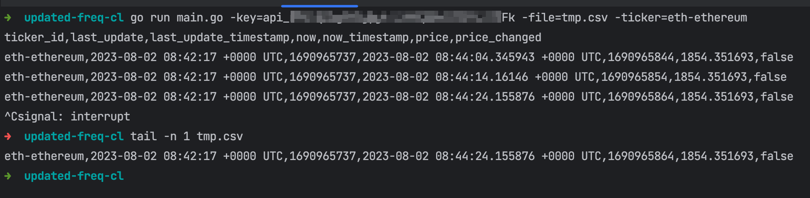
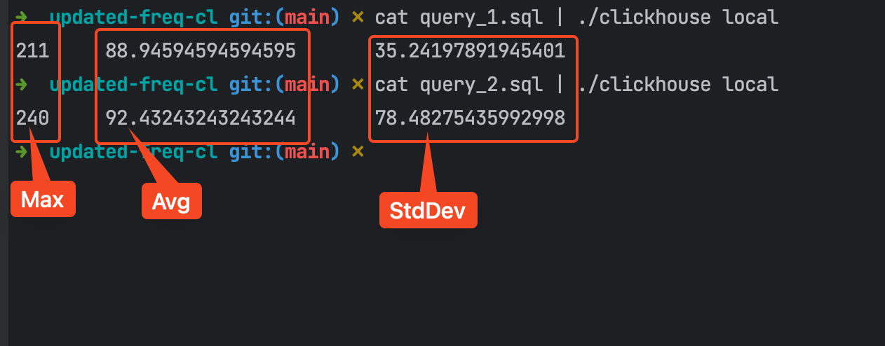
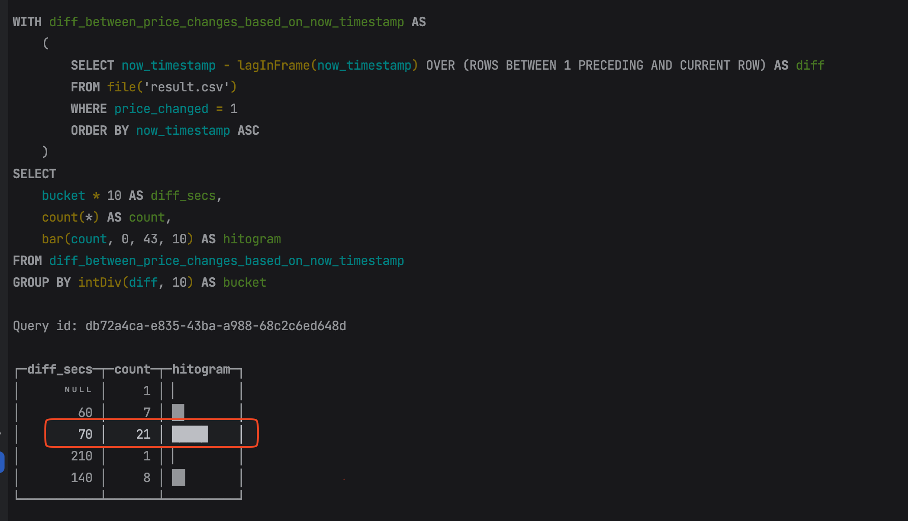

## Description
This programs query Coinpaprika API (https://api-pro.coinpaprika.com/v1/tickers) every 10 seconds
and saves the results to a csv file. It also prints the results to the console.

## Columns
* `ticker_id` - Coinpaprika API_ID
* `last_update` - `last_updated` field from the API (date/time format)
* `last_update_timestamp` - same as above but as a timestamp
* `now` - current date/time of loop run from local machine
* `now_timestamp` - same as above but as a timestamp
* `price` - `quotes.USD.Price` field from the API
* `price_changed` - `true` if the price changed since the last run, `false` otherwise

## Running
* all parameters besides `key` are optional
* default output file is `result.csv`
* `go run main.go -key=your_api_key` - this will run the program, print the results to the console and save them to a file called `result.csv`
* `go run main.go -key=your_api_key -file=filename.csv` - if you wish to change the output location
* `go run main.go -key=your_api_key -file=filename.csv -ticker=eth-ethereum` - if you wish to change the ticker

* 

### Alternative 
If you don't have Go installed, you can use the provided `script.sh` file to run the shell script, which produces similar results.
* edit `script.sh` and add your API key
* `sh script.sh | tee result.csv`

## Analysis 
1. `clickhouse local` is used for analysis, just because it's our database of choice at the moment.
You can work with Python/Pandas, DuckDB or any other database of your choice, using the CSV file as input.
2. You should run the program for a while (hour+) and use default output file `result.csv`
3. Example file with 1 hour of data (UTC: 2023-08-02 10:26 - 2023-08-02 11:26) is provided in the repository [result.csv](./result.csv)

### Setup
`curl https://clickhouse.com/ | sh` - this will install a local version of Clickhouse in current directory

### Queries
1. [query_1.sql](./query_1.sql) - show `max`, `avg`, `stdDev` time between price changes based on local time `now_timestamp` (in seconds)
   * `./clickhouse local < query_1.sql`
2. [query_2.sql](./query_2.sql) - show `max`, `avg`, `stdDev` time between price changes based on Paprika time  `last_update_timestamp` (in seconds)
   * `./clickhouse local < query_2.sql`

Running these queries on the provided `result.csv` file should give you the following results:
(with the following average response time around 90 seconds)

